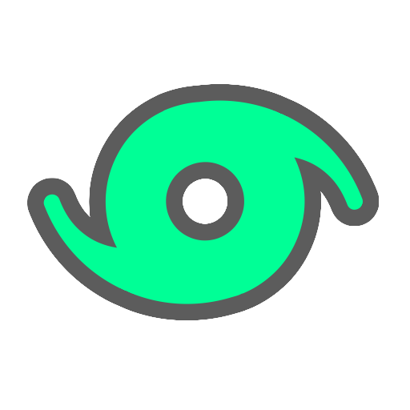

#  Rivett

Rivett is a high-performance image viewer designed for sorting and vetting large volumes of images. It focuses on speed and a keyboard-driven workflow, making it suitable for photographers and digital artists.

## Features

- **Performance:** Built with Rust and OpenGL for smooth panning and zooming, even with large files.
- **Format Support:** Standard web formats, high-dynamic-range imagery (EXR), vector graphics (SVG), and professional Camera RAW formats (.CR3, .ARW, .NEF, etc.) via LibRaw.
- **Windows Integration:** Includes an MSI installer that sets up a native "Open with Rivett" context menu and file associations.
- **Minimalist UI:** Interface designed to stay out of the way, with an optional panel for metadata and EXIF inspection.

## Installation

Professional installers are available for most platforms:

1.  Visit the [Releases](https://github.com/krets/rivett/releases) page.
2.  **Windows:** Download the `.msi` installer.
3.  **Linux:** Download the `.AppImage` or `.deb` package.
4.  **macOS:** Download the `.app` bundle.

## User Guide

Rivett is optimized for keyboard use, though it supports mouse interaction for inspection and navigation.

### Navigation
- **Left / Right**: Previous / Next image (resets zoom to fit).
- **Shift + Arrow**: Navigate while preserving the current zoom and pan position.
- **PageUp / PageDown**: Move quickly through a collection.

### Zoom & Pan
- **Scroll Wheel**: Zoom in and out at the cursor position.
- **Left Click + Drag**: Pan the image.
- **F**: Toggle "Fit to Window".
- **Ctrl + 0**: Zoom to actual size (1:1 pixels).
- **Arrow Up / Down**: Incremental zoom via keyboard.

### Vetting
- **1 - 5**: Set image rating.
- **0**: Clear rating.
- **[ / ]**: Rotate image 90° (saved to the local database).
- **Delete**: Delete the current file (requires two-step confirmation).
- **H**: Hide the image from the current session.
- **Right Click > Copy Image**: Copy the actual pixel data to your clipboard.

### Workflow
- **Right Click Drag** or **Ctrl + Left Click Drag**: On Windows, this initiates a native file drag. You can drop the image into other apps (Photoshop, Discord, etc.) to copy the file there.

### Tools
- **I**: Toggle the metadata info panel.
- **Right Click**: Open the context menu for all options.
- **Ctrl + Shift + R**: Reset session (clears filters and temporary session state).
- **Error Handling**: If a file fails to load, click the error message in the viewport to copy it to the clipboard.

## Supported Formats

- **Standard:** PNG, JPEG, WebP, BMP, GIF
- **Production:** OpenEXR (.exr), SVG
- **Camera RAW:** Canon (.CR2, .CR3), Sony (.ARW), Nikon (.NEF), Fujifilm (.RAF), Adobe Digital Negative (.DNG), and others supported by LibRaw.

## License

MIT
